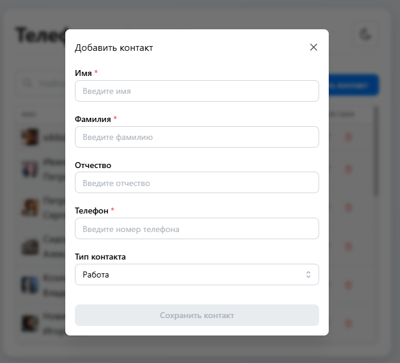
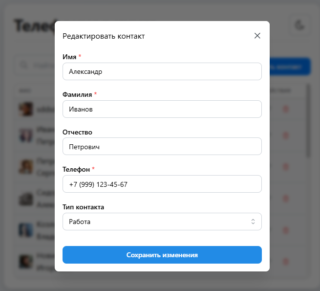
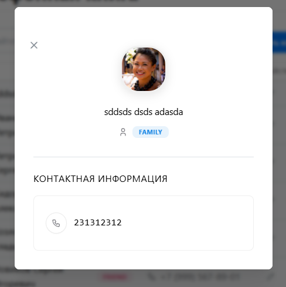

# 📱 ContactBook - Современная телефонная книга

<div align="center">


Современное веб-приложение для управления контактами с элегантным интерфейсом в стиле macOS

[Репозиторий](https://github.com/D4cLoves/ContactBook) • [Скриншоты](#-скриншоты) • [Документация](#)

</div>

---

## 📸 Скриншоты

<div align="center">

### Главный экран


### Добавление контакта


### Редактирование контакта


### Просмотр контакта


</div>

## ✨ Особенности

- 🎨 **Элегантный дизайн** - Интерфейс в стиле macOS с плавными анимациями и современной типографикой
- 🔍 **Умный поиск** - Мгновенный поиск контактов по имени, фамилии или номеру телефона
- 📝 **CRUD операции** - Полный набор операций: создание, чтение, обновление и удаление контактов
- 🏷️ **Категории контактов** - Организация контактов по типам: Работа, Семья, Друзья, Другое
- 💾 **Локальное хранилище** - Все данные сохраняются в браузере с использованием localStorage
- 🌓 **Темная/Светлая тема** - Переключение между темами одним кликом
- 📱 **Адаптивный дизайн** - Отлично работает на всех устройствах
- ⚡ **Быстрая работа** - Построено на Vite для молниеносной загрузки

## 🛠️ Технологии

### Frontend
- **React 19.1.0** - Современная библиотека для создания пользовательских интерфейсов
- **TypeScript 5.8.3** - Типизированный JavaScript для надежности кода
- **Vite 7.0.4** - Быстрый инструмент сборки и разработки
- **Mantine UI 8.2.1** - Комплексная библиотека компонентов
- **Tabler Icons** - Красивые иконки для интерфейса

### Архитектура
- **Custom Hooks** - Переиспользуемая логика управления состоянием
- **Модульные компоненты** - Чистая архитектура с разделением ответственности
- **CSS Modules** - Изолированные стили для каждого компонента
- **TypeScript Classes** - Модели данных с методами

## 🚀 Быстрый старт

### Предварительные требования

- Node.js 18+ 
- npm или yarn

### Установка

1. Клонируйте репозиторий:
```bash
git clone https://github.com/D4cLoves/ContactBook.git
cd ContactBook
```

2. Установите зависимости:
```bash
npm install
```

3. Запустите dev-сервер:
```bash
npm run dev
```

4. Откройте браузер по адресу `http://localhost:5173`

### Сборка для продакшена

```bash
npm run build
```

Собранные файлы будут в папке `dist/`

### Предпросмотр продакшен-сборки

```bash
npm run preview
```

## 📖 Использование

### Добавление контакта

1. Нажмите кнопку **"Добавить контакт"**
2. Заполните форму:
   - Имя (обязательно)
   - Фамилия (обязательно)
   - Отчество (опционально)
   - Номер телефона (обязательно)
   - Тип контакта (Работа, Семья, Друзья, Другое)
3. Нажмите **"Сохранить контакт"**

### Поиск контактов

Используйте поле поиска в верхней части страницы для быстрого поиска по:
- Имени и фамилии
- Номеру телефона

### Редактирование контакта

1. Нажмите на иконку карандаша рядом с контактом
2. Внесите изменения в модальном окне
3. Нажмите **"Сохранить изменения"**

### Просмотр деталей контакта

Кликните на строку с контактом, чтобы открыть детальную информацию

### Удаление контакта

Нажмите на иконку корзины рядом с контактом для удаления

## 📁 Структура проекта

```
Phone-book/
├── src/
│   ├── components/          # React компоненты
│   │   ├── AddContactModalPage/    # Модальное окно добавления
│   │   ├── Contact/                # Модель контакта
│   │   ├── ContactViewModal/       # Просмотр деталей контакта
│   │   ├── DarkLightButton/        # Переключатель темы
│   │   ├── OnEditModalPage/        # Модальное окно редактирования
│   │   ├── RenderContacts/         # Таблица контактов
│   │   └── SearchContact/          # Компонент поиска
│   ├── hooks/               # Custom React hooks
│   │   └── useContacts.ts   # Логика управления контактами
│   ├── App.tsx              # Главный компонент
│   ├── main.tsx             # Точка входа
│   └── index.css            # Глобальные стили
├── public/                  # Статические файлы
├── package.json
├── tsconfig.json
└── vite.config.ts
```

## 🎨 Дизайн

Приложение использует дизайн-систему, вдохновленную macOS:
- Чистые линии и минимализм
- Плавные тени и размытия
- Системные шрифты Apple
- Цветовая палитра в стиле macOS
- Плавные анимации и переходы

## 🔧 Разработка

### Линтинг

```bash
npm run lint
```

### Форматирование кода

Проект использует ESLint для поддержания качества кода.

## 📝 Лицензия

Этот проект создан в образовательных целях.

## 👨‍💻 Автор

**D4cLoves**

- GitHub: [@D4cLoves](https://github.com/D4cLoves)
- Telegram: [@D4cLoves](https://t.me/D4cLoves)

## 🙏 Благодарности

- [Mantine](https://mantine.dev/) - за отличную библиотеку компонентов
- [Tabler Icons](https://tabler.io/icons) - за красивые иконки
- [Vite](https://vitejs.dev/) - за быстрый инструмент сборки

---

<div align="center">

**Сделано с ❤️ используя React и TypeScript**

⭐ Если проект вам понравился, поставьте звезду!

</div>
